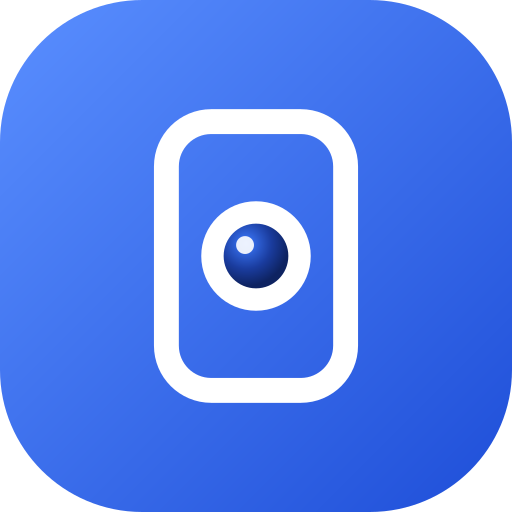

<p align="center"></p>

<h1 align="center">Camerold</h1>

<p align="center">
  <b>Biến điện thoại Android cũ thành camera an ninh xem trực tiếp.</b><br>
  Xem từ điện thoại khác hoặc trình duyệt, qua Wi‑Fi hay 4G.<br>
  Miễn phí · không cần tài khoản · không cần máy chủ riêng · mã hoá đầu‑cuối · không lưu video.
</p>

<p align="center">
  <a href="LICENSE"></a>
  
  
  
</p>

<p align="center">
  <a href="../../releases/latest/download/Camerold.apk"></a>
</p>
<p align="center"><a href="../../releases">Tất cả phiên bản</a> · <a href="README.md">English</a></p>

---

## Mục lục

- [Vì sao có Camerold](#vì-sao-có-camerold)
- [Tính năng](#tính-năng)
- [Bắt đầu sử dụng](#bắt-đầu-sử-dụng)
- [Xem bằng máy tính](#xem-bằng-máy-tính)
- [Xem bằng 4G](#xem-bằng-4g)
- [Máy chủ kết nối](#máy-chủ-kết-nối)
- [Để điện thoại cũ chạy 24/7](#để-điện-thoại-cũ-chạy-247)
- [Máy nào dùng được?](#máy-nào-dùng-được)
- [Riêng tư và bảo mật](#riêng-tư-và-bảo-mật)
- [Xử lý sự cố](#xử-lý-sự-cố)
- [Cách hoạt động](#cách-hoạt-động)
- [Tự build](#tự-build)
- [Đóng góp](#đóng-góp) · [Giấy phép](#giấy-phép)

## Vì sao có Camerold

Nhà nào cũng có một chiếc điện thoại cũ nằm trong ngăn kéo. Nó đã có sẵn camera tốt, micro, Wi‑Fi, và viên pin như
một bộ lưu điện nhỏ. Camerold biến nó thành camera xem trực tiếp từ bất cứ đâu: phòng khách, em bé, thú cưng,
cửa ra vào, máy in 3D… mà không phải mua thiết bị, không cần tạo tài khoản, và không phải gửi video của bạn lên
dịch vụ đám mây nào.

## Tính năng

**Hình ảnh và âm thanh**
- Video trực tiếp đến **4K** bằng chip mã hoá phần cứng của máy (H.264, hoặc VP8 để tương thích), kèm **âm thanh**.
- **Ống kính**: góc rộng (ví dụ 0.6×), chính, tele và camera trước, tuỳ máy có gì.
- Zoom trên cảm biến, **đèn flash**, **chế độ ban đêm**, độ sáng, **lấy nét** (tự động, chạm để lấy nét, khoá,
  chỉnh tay, xa), chống rung, chất lượng, độ mượt và khung hình (4:3 thấy trọn cảm biến, 16:9 vừa màn hình ngang).
- **Góc rộng nét hơn**: tăng độ nét và chất lượng nén cho cảm biến góc rộng vốn nhỏ.

**Xem**
- Bằng **app Android hoặc trình duyệt bất kỳ**; cả hai dùng chung một trình xem.
- **Trình phát kiểu YouTube**: cầm dọc thì thông tin nằm dưới video; xoay ngang là vào toàn màn hình, thanh điều
  khiển tự ẩn, thanh thời gian được thay bằng thanh zoom. Chụm hai ngón để zoom; vừa hoặc lấp đầy màn hình.
- **Nhiều camera** trong một danh sách, mỗi camera có tên riêng. Bấm để xem; chia sẻ mã QR hoặc xoá từng camera.
- **Chụp ảnh** đúng độ phân giải đang nhận, lưu vào thư viện ảnh (app) hoặc tải về (trình duyệt).
- **Tình trạng máy camera**: pin, đang sạc hay không, nhiệt độ, bộ nhớ trống, thời gian đã chạy, kèm cảnh báo khi
  pin yếu mà không sạc (thường do tuột dây sạc).
- Tối đa **3 người xem** cùng lúc.

**Kết nối**
- **Kết nối nhanh bằng mã QR**: quét bằng app, trang xem, hoặc ứng dụng camera của điện thoại. Máy tính không có
  webcam thì tải lên, dán hoặc kéo thả ảnh chụp mã QR.
- **Kết nối thẳng và mã hoá đầu‑cuối**: hình và tiếng đi thẳng giữa hai máy.
- **Không cần máy chủ riêng**: hai máy tìm thấy nhau qua các máy chủ MQTT công cộng miễn phí, hoặc máy chủ của
  bạn (xem [Máy chủ kết nối](#máy-chủ-kết-nối)).
- **Xem bằng 4G** với máy chủ chuyển tiếp (TURN) tuỳ chọn. Có thể nhập trên máy xem rồi gửi sang máy camera, khỏi
  phải gõ trên máy cũ.

**Dành cho điện thoại cũ chạy liên tục**
- **Chạy nền** cả khi tắt màn hình, tự lấy lại camera khi ứng dụng khác dùng xong.
- **Tự nghỉ khi không ai xem**: camera tự tắt và tự bật lại khi có người mở xem.
- **Bảo vệ khi máy nóng**: pin nóng thì giảm số hình/giây, rồi giảm độ phân giải, máy nguội thì tự trở lại. Có thể
  chỉnh nhiệt độ bắt đầu, hoặc tắt hẳn.
- Dùng được chip mã hoá phần cứng cả trên máy Android 8–9 chạy chip MediaTek, Kirin, Unisoc, và chỉ cho chọn những
  mức chất lượng máy thật sự làm được.
- Báo cáo lỗi dễ đọc (luồng bị lỗi và nhật ký cuối) để sao chép gửi kèm khi báo lỗi.

**Và**
- Giao diện sáng/tối. **Tiếng Việt và tiếng Anh**; thêm ngôn ngữ mới chỉ cần thêm file bản dịch.

## Bắt đầu sử dụng

Bạn cần hai thiết bị: điện thoại cũ (làm camera) và thiết bị để xem.

1. **Cài app** lên điện thoại cũ, và lên điện thoại Android dùng để xem.
   **[Tải Camerold.apk bản mới nhất](../../releases/latest/download/Camerold.apk)** (hoặc chọn phiên bản khác trong
   [Releases](../../releases)), rồi cho phép cài đặt khi Android hỏi.
2. Trên **máy camera**:
   1. Mở Camerold → **Dùng làm camera**.
   2. Có thể đặt **Tên camera** (ví dụ "Phòng khách").
   3. Bấm 🎲 cạnh ô mật khẩu để tạo mật khẩu mạnh. Không ai phải nhớ mật khẩu này.
   4. Bấm **Bắt đầu phát**. Nếu có dải cảnh báo vàng nói Android có thể tự tắt camera khi chạy nền, bấm **Cho phép**.
3. Trên **máy xem**:
   1. Mở Camerold → **Xem camera** → **Quét mã QR trên máy camera**.
   2. Trên máy camera, bấm **Mã QR xem nhanh** rồi đưa máy xem vào quét.
   3. Camera được lưu trong **Camera của bạn**. Lần sau chỉ cần bấm vào.

Bạn cũng có thể nhập mã camera và mật khẩu thay vì quét.

> **Mẹo:** để máy camera cắm sạc, tắt màn hình bằng nút cạnh **Dừng phát**, và xem mục *Cài đặt camera → Khi máy
> nóng* nếu máy đặt ở chỗ nóng.

## Xem bằng máy tính

Trang xem là trang web tĩnh trong thư mục [`web/`](web), đặt ở đâu cũng chạy.

- **GitHub Pages** (đã có sẵn workflow): trong repo của bạn, mở **Settings → Pages → Source: GitHub Actions**.
  Trang xem sẽ có ở `https://<user>.github.io/<repo>/`.
- **Chạy trên máy**: `python3 -m http.server -d web 8080`, rồi mở <http://localhost:8080>.

Để kết nối, quét mã QR của camera bằng webcam, hoặc **tải lên, dán (Ctrl+V) hay kéo thả ảnh chụp** mã QR.
Trang cần chạy qua HTTPS (hoặc `localhost`) vì dùng tính năng mã hoá và camera của trình duyệt.

## Xem bằng 4G

Ở nhà, hai máy thường kết nối thẳng được. Nhiều nhà mạng di động dùng NAT kiểu nhà mạng (CGNAT), chặn kết nối
thẳng; khi đó cần **máy chủ chuyển tiếp (TURN)**. Máy chủ này chỉ được dùng khi không thể kết nối thẳng.

1. Tạo tài khoản miễn phí, ví dụ ở [ExpressTURN](https://www.expressturn.com/). Bạn sẽ có địa chỉ máy chủ
   (dạng `free.expressturn.com:3478`), tên đăng nhập và mật khẩu.
2. Nhập vào **một trong hai** nơi:
   - trên máy camera: *Cài đặt camera → Xem bằng 4G* → **Kiểm tra máy chủ**, **hoặc**
   - từ máy xem khi đang kết nối: *⚙ (cài đặt camera) → Xem qua 4G (máy chủ chuyển tiếp)* → **Gửi sang camera**.
     Máy camera tự lưu, tự thử và báo kết quả về.
3. Người xem tự nhận thông tin này từ máy camera, trong tin nhắn đã mã hoá.

Nên biết:
- Địa chỉ không ghi giao thức sẽ được thử cả UDP lẫn TCP, vì nhiều mạng chặn UDP ở cổng 3478.
- Trên trang xem, *Cài đặt → Khi gặp sự cố → Kiểm tra mạng* cho biết mạng đang dùng có cần máy chủ chuyển tiếp không.
- Khi đang xem, bảng thông tin (ⓘ) cho biết đang kết nối thẳng hay qua máy chủ chuyển tiếp.
- Dùng VPN dạng mạng riêng như Tailscale trên cả hai máy cũng được, không cần máy chủ chuyển tiếp.

## Máy chủ kết nối

Trước khi có hình, máy camera và máy xem trao đổi vài tin nhắn nhỏ đã mã hoá để tìm thấy nhau. Mặc định việc này
đi qua **bốn máy chủ MQTT công cộng miễn phí** cùng lúc (EMQX, HiveMQ, Mosquitto, shiftr.io), nên một cái sập cũng
không sao. Các máy chủ này chỉ thấy dữ liệu đã mã hoá và không bao giờ chuyển video.

Muốn dùng máy chủ riêng: *Cài đặt camera → Máy chủ kết nối → Máy chủ riêng của bạn*. Có sẵn mẫu cho
**HiveMQ Cloud** và **EMQX Cloud** (đều có gói miễn phí hỗ trợ WebSocket + TLS), **CloudAMQP (LavinMQ)**, hoặc bất kỳ
địa chỉ `wss://` nào. Nút **Kiểm tra máy chủ** thử kết nối thật, và có thể giữ máy chủ công cộng làm dự phòng.
Mã QR mang theo thông tin máy chủ nên người xem không phải nhập.

> Tài liệu của CloudAMQP ghi MQTT qua WebSocket chỉ có ở gói RabbitMQ dành riêng (trả phí). Mẫu LavinMQ có thể dùng
> được với gói miễn phí; bấm **Kiểm tra máy chủ** để biết chắc.

## Để điện thoại cũ chạy 24/7

- **Giữ máy mát**: tháo ốp, tránh nắng, đừng đặt trên vải hay nệm. Củ sạc chậm (5 V / 1 A) ít nóng hơn sạc nhanh;
  thêm một quạt USB nhỏ thổi vào lưng máy rất hiệu quả.
- **Tắt màn hình** khi đang phát (nút cạnh *Dừng phát*), hoặc khoá máy; camera vẫn phát bình thường.
- **Cho phép chạy nền.** Một số hãng (Xiaomi, Samsung, Oppo, Huawei…) hay tự tắt app chạy nền:
  *Cài đặt camera → Chạy nền → Cài đặt riêng cho máy này* mở hướng dẫn đúng hãng máy của bạn
  ([dontkillmyapp.com](https://dontkillmyapp.com)).
- **Bảo vệ khi máy nóng** mặc định bắt đầu khi pin đạt 44 °C (rồi 47 và 50 °C). Nếu máy chỉ hơi ấm mà vẫn bị giảm
  chất lượng, tăng mức này trong *Cài đặt camera → Khi máy nóng*; bảng ⓘ trên máy xem có hiện nhiệt độ hiện tại.
- Full HD 24–30 hình/giây là lựa chọn cân bằng để chạy lâu; 4K nóng hơn rõ rệt.

## Máy nào dùng được?

Máy **Android 8.0 trở lên** có camera đều làm camera được. Điện thoại Android bất kỳ hoặc trình duyệt hiện đại
(Chrome, Edge, Firefox, Safari) đều xem được. App không gắn với dòng máy nào: ống kính, độ phân giải, số hình/giây,
lấy nét, đèn flash và chất lượng cao nhất đều đọc từ chính máy đó, tính năng nào máy không có thì tự ẩn.

- **4K** cần cả camera *và* chip mã hoá video của máy hỗ trợ; nếu không, app chỉ cho chọn mức cao nhất máy làm được.
- **Góc rộng** hiện ra khi máy cho app khác dùng (đa số máy từ Android 11, nhiều máy cũ hơn cũng có; camera bị ẩn trên
  máy Samsung, Xiaomi, Oppo đời cũ được tự dò tìm khi có thể).

App được phát triển và thử trên Pixel 5 (Android 14). Rất mong nhận phản hồi từ các máy khác; vui lòng ghi kèm tên
máy và phiên bản Android.

## Riêng tư và bảo mật

- **Hình và tiếng** đi thẳng giữa hai máy qua WebRTC, mã hoá bằng DTLS‑SRTP. Máy chủ chuyển tiếp (nếu dùng) chỉ
  chuyển các gói đã mã hoá mà nó không đọc được.
- **Tin nhắn kết nối** được mã hoá AES‑256‑GCM, khoá tạo từ mật khẩu camera bằng PBKDF2 (600 000 vòng). Kênh trên máy
  chủ MQTT cũng tạo từ mật khẩu, nên chỉ biết mã camera thì không tìm ra được. Mỗi tin nhắn có dấu thời gian và mã
  riêng để chống phát lại.
- **Không ghi hình, không tải lên đâu cả**, không có tài khoản, không thu thập dữ liệu sử dụng.
- **Ai có mã camera và mật khẩu (hoặc mã QR) đều xem và chỉnh được cài đặt camera.** Hãy dùng mật khẩu do app tạo, và
  chỉ chia sẻ mã QR cho người tin cậy. Mã QR chứa mật khẩu nên tự đóng sau 90 giây.

Chi tiết: [docs/PROTOCOL.md](docs/PROTOCOL.md). Báo lỗ hổng bảo mật: xem [SECURITY.md](SECURITY.md).

## Xử lý sự cố

| Hiện tượng | Cách xử lý |
|---|---|
| Ở nhà xem được, ra 4G không được | Cài máy chủ chuyển tiếp ([Xem bằng 4G](#xem-bằng-4g)); khi đó bảng ⓘ sẽ ghi đang đi qua máy chủ chuyển tiếp. |
| Máy xem không tìm thấy camera | Máy camera có đang phát và có mạng không? Đúng mã và mật khẩu chưa? Nếu camera dùng máy chủ riêng, hãy thêm camera bằng cách quét mã QR. |
| Camera tự tắt sau một lúc | Cho phép chạy nền và làm theo *Cài đặt riêng cho máy này*; để máy cắm sạc. |
| Chất lượng giảm, có cảnh báo nóng | Máy đang nóng: làm mát tốt hơn, hoặc tăng nhiệt độ bắt đầu trong *Khi máy nóng*. |
| Hình đen hoặc đứng | Có thể app khác đang dùng camera (sẽ tự phát lại). Nếu không, thử *Định dạng video → Tương thích*. |
| Máy tính không có webcam | Tải lên, dán hoặc kéo thả ảnh chụp mã QR của camera. |
| App bị lỗi, tự thoát | Mở lại app, bấm **Sao chép thông tin** rồi gửi kèm khi [báo lỗi](../../issues/new/choose). |

## Cách hoạt động

```
 Máy camera (Wi‑Fi ở nhà)                                Máy xem (điện thoại / trình duyệt, Wi‑Fi hoặc 4G)
 ┌────────────────────────┐  1. tìm thấy nhau            ┌─────────────────────────┐
 │ Camera2 → H.264/VP8    │ ◄──── máy chủ MQTT ────────► │ App Android hoặc web    │
 │ mã hoá + micro         │   (tin nhắn AES‑256‑GCM)     │                         │
 │                        │                              │                         │
 │                        │ ══ 2. WebRTC, kết nối thẳng ►│ hình + tiếng, điều khiển│
 └────────────────────────┘    (mã hoá DTLS‑SRTP)        └─────────────────────────┘
               3. (tuỳ chọn) máy chủ chuyển tiếp TURN khi mạng chặn kết nối thẳng
```

Trang xem được đóng gói sẵn vào app Android khi build, nên chỉ có một trình xem duy nhất.
Thêm: [docs/ARCHITECTURE.md](docs/ARCHITECTURE.md) · [docs/PROTOCOL.md](docs/PROTOCOL.md)

## Tự build

Cần có: JDK 17, Android SDK (platform 35), Node.js 20+ (chỉ để chạy test web).

```bash
./gradlew assembleDebug                      # app/build/outputs/apk/debug/app-debug.apk
./gradlew assembleRelease                    # ký bằng khoá debug nếu chưa cấu hình khoá phát hành
./gradlew testDebugUnitTest                  # test Kotlin
NETWORK_TESTS=1 ./gradlew testDebugUnitTest  # thêm test gửi/nhận thật qua các máy chủ công cộng
node --test tests/*.test.mjs                 # test trang xem
python3 -m http.server -d web 8080           # trang xem tại http://localhost:8080
```

### Phát hành phiên bản mới

1. Thêm mục `## 3.2.0` vào [CHANGELOG.md](CHANGELOG.md) (nội dung này thành ghi chú phát hành).
2. Gắn tag và đẩy lên: `git tag v3.2.0 && git push origin v3.2.0`.

[`release.yml`](.github/workflows/release.yml) sẽ chạy test, build APK với số phiên bản lấy từ tag (`v3.2.0` →
versionName 3.2.0, versionCode 30200), rồi tạo bản phát hành trên GitHub kèm `Camerold.apk` và mã SHA‑256. Tag dạng
`v3.2.0-beta.1` được đánh dấu là bản thử nghiệm. Tên file luôn giữ nguyên nên link tải ở đầu trang luôn trỏ tới bản
ổn định mới nhất.

**Ký ứng dụng.** Thêm các secret sau vào repo để mọi bản phát hành có cùng chữ ký, người dùng cài đè được:
`ANDROID_KEYSTORE_BASE64` (file keystore mã hoá base64), `ANDROID_KEYSTORE_PASSWORD`, `ANDROID_KEY_ALIAS`,
`ANDROID_KEY_PASSWORD`. Nếu thiếu, bản phát hành được ký bằng khoá tạm và ghi chú phát hành sẽ nói rõ điều đó.

```bash
keytool -genkeypair -v -keystore camerold-release.jks -alias camerold -keyalg RSA -keysize 4096 -validity 10000
base64 -i camerold-release.jks | pbcopy   # macOS; trên Linux: base64 -w0 camerold-release.jks
```

Giữ kỹ file keystore và mật khẩu (và không đưa vào repo): mất chúng thì không phát hành được bản cập nhật cài đè lên
bản cũ.

Cấu trúc thư mục: xem phần *Project structure* trong [README.md](README.md#project-structure).

## Đóng góp

Rất hoan nghênh báo lỗi, phản hồi về các dòng máy, bản dịch và pull request; xem [CONTRIBUTING.md](CONTRIBUTING.md).
Thêm ngôn ngữ mới chỉ cần một file bản dịch cho app và một khối trong `web/js/i18n.js`. Vui lòng tuân theo
[Quy tắc ứng xử](CODE_OF_CONDUCT.md). Danh sách thay đổi: [CHANGELOG.md](CHANGELOG.md).

## Giấy phép

[GNU GPL v3.0](LICENSE). Bạn được dùng, tìm hiểu, chia sẻ và sửa đổi Camerold; nếu phát hành bản đã sửa đổi, bản đó
cũng phải theo giấy phép GPL và công bố mã nguồn.

Các thành phần bên thứ ba giữ giấy phép riêng, đều tương thích GPL: WebRTC (BSD, qua `io.github.webrtc-sdk`),
OkHttp (Apache‑2.0), ZXing (Apache‑2.0), jsQR (Apache‑2.0, `web/vendor/jsQR.js`),
qrcode-generator (MIT, `web/vendor/qrcode.js`).
